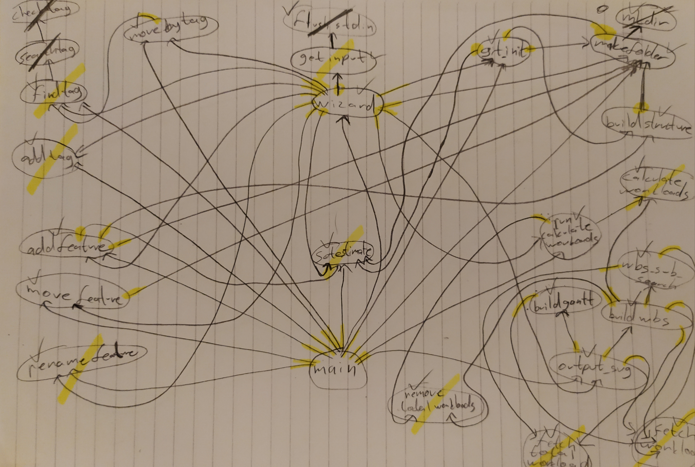

**The code is commented entirely and it is clear.**  
**The code is divided logically into smaller files and connected to the main through a header file.**   
**Explained every parameter in the comments for each of my functions.**   
**Listed the external function dependencies for each function (if there is any) inside the comments**  
**There are options to add cost (workload estimate) to a Project, Feature and Folder when creating them both from the wizard and the command line (by adding the optional cost argument at the end e.g --cost=30), as well as adding it later on.**  
**Wizard has a 30 seconds time limit for the input, also when a new input is asked, which characters will be allowed/disallowed in the input is specified custom for that input. Cannot enter empty input or an input with bad character or an input that is longer than the length limit specific for each input.**   
**Renaming feature works on plain folders too, however, renaming a feature will also rename the branch for it as well.**   

---
__Check List:__

- [x] 1.  Be able to create basic file structure for project
- [x] 2.  Abort if requested project/feature name already exists under 'root' folder.  Here 'root' does not mean the / root of the file system, but the folder from which the program  is run.
    - [x] 1. Requires checking existing file system for matching name
    - [x] 2. Requires using branching (_if_) to exit program if necessary
- [x] 3.  Initialise git repository
   - [x] 1. _**Should**_ set up CSGitLab project etc.
- [x] 4.  Feature management
    - [x] 1. _**Must**_ implement a method of having a shorthand code for feature e.g. F1, F2.1..., stored in a file.
    - [x] 2. _**Must**_ implement lookup to facilitate getting path from shorthand code
    - [x] 3. _**Should**_ include setting up git branch as appropriate

- [x] 5. Include mechanism for renaming features (subtrees)
- [x] 6. Include mechanism for moving feature to new location in tree (folder hierarchy)
- [x] 7. Output tree diagram - PBS or WBS (svg, using plantuml)
    - [x] 1. Requires tree walk (iterative or recursive) 
    - [x] 2. _**Must**_ exclude folders that start with a '.'   
**(note: also excludes bin, lib, tests, src, docs)**
    - [x] 3. _**Should**_ use the plantuml tool
    1. _**Could**_ implement from scratch (much harder, more marks)
- [x] 8. Time/workload estimate information stored in files in subfolders
    - [x] 1. _**Should**_ have mechanisms for adding these from the program not just editing the files
    - [x] 2. _**Should**_ include subtrees costs in parent tree total
- [x] 9. Time/workload added to output diagram
    - [x] 1. _**Could**_ also produce Gantt chart (using plantuml) 

- [x] 10. Output diagram includes links (when used in browser, for example)
    - [x] 1. _**Should**_ use plantuml to do this
11.  Dependencies information across tree branches
    1. _**Must**_ identify relevant other paths in tree to do this

### Elite challenges ("Won't do" in MoSCoW terms) (up to 20% for each top level feature)

- [x] 12. Guided work breakdown wizard (Slightly advanced, would require interactive questions/answer handling)
    - [x] 1. Needs a number of sub-features, such as minimum time allocation threshold, user input parsing 
13. Multi-user (Advanced, would require some form of permissions model)
    1. may be best done using a traditional SQL database, but can use flat files.  Complex task.
14. Available as web application (Advanced, probably easiest creating a simple embedded server)
    1. sample code for simple communications between applications will be covered
15. GOAP recommendation of suitable pathway (Advanced, can use existing GOAP library, however)
    1. GOAP uses a 'heap' data structure  

---
## Goals 

Identify the key goals you need to complete for the coursework

1. Must have most of the features listed.
1. Final program should be simple to use and user friendly.
1. Should comment everything worthy so it is simple to understand for someone else.
1. Can also have extra features.
1. Should have my features in separate files and link them.

## Requirements to fulfill goals

What do you need to be able to meet those goals?  This can include clearer specifications, tests (what needs testing, how to test it?), knowledge etc.

1. Plan ahead of what to do.
1. Decide my approach to how to code it.
1. Make the things I am not sure about more clear.
1. Discuss how the final project should be.
1. Make a to-do list and put the things need to be done in order.

## Dependencies (mapping goals/requirements etc)

Which requirements relate to which goals - think about drawing out a Product Breakdown for the coursework

## Plan:

1. Try doing simple operations on bash and on C to decide which one to use.
1. Design the layout of the program.
1. Investigate how to go about coding for some features including stuff I have not had experience with.
1. Implement in my code the functionalities the program should have.
1. Check if everything is how they are supposed to be and wrap everything up.

### What were the results of trying things out?

1. I decided to use C for coding.
1. I decided to make modifications on the coding environment to make it easier to work with.
1. I decided to manually test every feature after coding each.
1. I decided to test my code on different environments (operating systems) to see if it works as it should.
1. I decided to use newly learned features of C, after experimenting with them.

---

## List of commands can be used :
Note: Arguments in double square brackets "[[ ]]" are optional.

- 'pm help' for the list of options.
- 'pm' (with no arguments) to run the wizard.
- 'pm create_project [project_name] [[-cost=]]'  
to create a new git project.
- 'pm add_feature [feature_name] [[-cost=]]'  
to add feature.
- 'pm add_tag [tag_name]'  
to add tag.
- 'pm find_tag [tag_name]'  
to find tag.
- 'pm move_by_tag [tag1] [tag2]'  
to move the feature with 'tag1' to the feature with 'tag2'.
- 'pm output_svg [project_name]'  
to create diagrams from the project folder in svg files.
- 'pm rename_feature [old_feature] [new_name]'  
to rename a feature.
- 'pm move_feature [origin_directory] [destination_directory]'  
to move feature.
- 'pm create_folder [folder_name] [[-cost=]]'  
to create a new folder/directory.
- 'pm calculate_workloads [folder_name]'  
to calculate the workload for a project/feature.
- 'pm set_estimate [directory] [workload]'  
to set the workload estimate of a project/feature/folder.
           